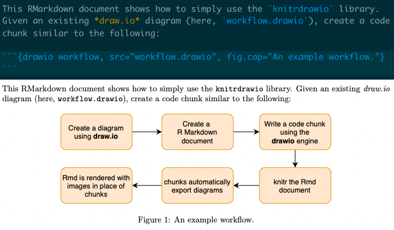

# Drawio engine for Knitr

> Author: rchaput \<rchaput.pro\@gmail.com\>

## Description

This package adds a `drawio` engine to [knitr], which can be used to 
automatically export [draw.io] diagrams into images from code chunks in 
RMarkdown documents.

## Preview



## Installation

This package is only available on GitHub, you will therefore need to install 
`remotes` first:

```r
# Install the remotes package to install packages directly from GitHub
install.packages("remotes")
# Now, install the knitrdrawio package from GitHub
remotes::install_github("rchaput/knitrdrawio")
```

Alternatively, you can also use `devtools`:

``` r
install.packages("devtools")
devtools::install_github("rchaput/knitrdrawio")
```

Note that this package requires the `knitr` package (which you should already 
have if you are writing Rmd documents).

It also requires to have installed on your system the `draw.io` binary.

### On Docker (CI, etc.)

Draw.io requires a slightly different setup on headless environments (without 
a graphical server), such as Docker containers and in particular Continuous 
Integration workflows.

The following 2 points are important in such cases:

* The `xvfb-run` binary must be available on the system. On most Linux
  distributions, it can be obtained by installing the `xvfb` package through
  the distribution's package manager (apt, rpm, ...).
  *Note: `xvfb-run` provides the virtual graphical server that is required
  for `draw.io` to function. **knitrdrawio** will automatically encapsulate
  calls to `draw.io` if a headless environment is detected and `xvfb-run` is
  present. Alternatively, one can set the `$DISPLAY` environment variable to
  a (virtual) graphical server.*

* It is strongly recommended to install `draw.io` [16.0.0][drawio16].
  *Note: more recent versions of `draw.io` ship Electron 16.x, which seems to
  have a problem with D-Bus, making `draw.io` crash on headless environments.*

## Usage

First, load the package in some code chunk, preferably at the beginning of your 
Rmd document:
````
```{r setup, include=FALSE}
library(knitr)
library(knitrdrawio)
```
````

After that, you can use [draw.io] diagrams in your Rmd document by using
code chunks with the `drawio` engine:
````
```{drawio my-super-diag1, src="path/to/my-diag.drawio"}
```
````

Note that the `code` part of the chunk is empty (there is nothing after the 
header). You can customize the export process by using the chunk options. In 
the previous example, only the `src` option was specified: it is a mandatory 
option that sets the source diagram to export.

When the document is processed by [knitr], the code chunk will be replaced
by the resulting image.

## Chunk options

Several chunk options are available to help you export the diagram exactly
as you want.

### Drawio-specific options

The following options are directly based on the [draw.io] available options
(which you can get by using `draw.io --help` from a command-line interface):

| Chunk option | draw.io equivalent | Description                                                                           | Default value                                                                         |
|--------------|--------------------|---------------------------------------------------------------------------------------|---------------------------------------------------------------------------------------|
| src          | [input file]       | Path to the diagram to export                                                         | (Mandatory argument)                                                                  |
| format       | -f --format        | Export format to use. Possible values are: pdf, png, jpg, svg, vsdx, xml              | Depends on the document output format  latex => pdf html => svg other => png          |
| crop         | --crop             | Crop resulting image to diagram size                                                  | TRUE                                                                                  |
| transparent  | -t --transparent   | Set transparent background for PNG                                                    | FALSE                                                                                 |
| border       | -b --border        | Set border width around diagram                                                       | 0                                                                                     |
| page.index   | -p --page-index    | Select a specific page                                                                | output format is an image => 1st page is selected otherwise => all pages are exported |
| page.range   | -g --page-range    | Similar to page.index, but selecting a range instead. For PDF only. Usage: "from..to" | NULL                                                                                  |

### Basic Knitr options

Some of the options defined in [knitr] can also be used, below is a list of
a few important ones. A full list can be found in the 
[documentation][knitr-options] ; however, not all of them have been tested with
`knitrdrawio`.

* `label`: A meaningful value should be given to this option, as it is used to
name the resulting image. By default, [knitr] will set a label if not specified,
but it might be harder to identify. Note that [knitr] allows to skip the 
`label=` part for this specific option, so in our examples you will only see
`{drawio <label>}`.
* `engine.path`: By default, this package will try to find the `draw.io` 
executable in a sane default location, depending on your OS, but if the 
executable cannot be found, you can set this option to override it.
Alternatively, you can set this option at a global level:
````
```{r setup}
knitr::opts_chunks$set(engine.path = list(
    drawio = "/path/to/your/draw.io"
))
```
````
* `engine.opts`: You can manually set additional command-line arguments that 
will be given to `draw.io`. Although most of the `draw.io` arguments should
be handled by our engine's options, this is useful if one of your use cases
is not covered.
* `eval`: Set to `FALSE` to completely disable this chunk. Nothing will be
executed, and the diagram will not be exported.
* `include`: Set to `FALSE` to only disable the inclusion of the result in
the Rmd document. The chunk will still be executed, and the diagram exported
as an image in your file system, but it will not appear in the document.
This is useful if you want to automatically export diagrams, but manually
include the images.
* `cache`: Set to `TRUE` to cache the chunk execution. The chunk will not
be re-executed as long as the chunk options and the diagram source file's
checksum stay the same.
* `fig.path`: A prefix for the path to which the resulting image is written.
Useful for, e.g., writing all figures to a `figure/` directory.
Non-existing directories are created.

[knitr]: https://yihui.org/knitr/
[knitr-options]: https://yihui.org/knitr/options/
[draw.io]: https://diagrams.net/
[drawio16]: https://github.com/jgraph/drawio-desktop/releases/tag/v16.0.0
